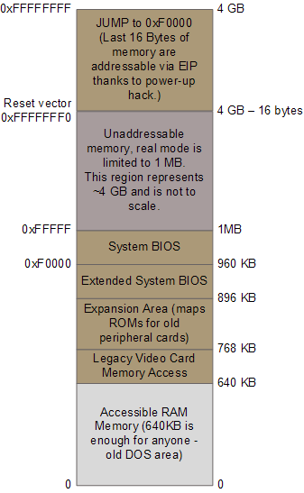
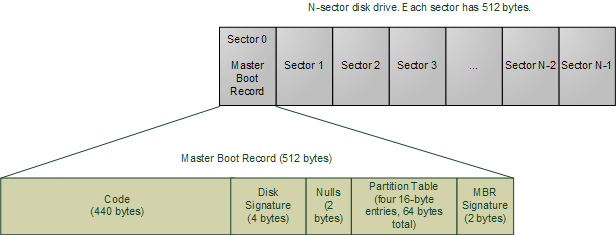

# [翻译] 计算机是如何启动的（2/3）

原文地址: https://manybutfinite.com/post/how-computers-boot-up/

*译者前言：在研究 Linux + QEMU 时搜索到这篇文章，写得很好，和实验观察结果也一致。因此先翻译了前一个post，接着重点翻译这一个。供交流和学习使用。*

*翻译时间：2020年2月10日*

上一个post描述了Intel计算机中的主板和内存映射相关内容，设定了计算机启动时的初始状态的基本描述。计算机的启动（booting）是一个involved, hacky, muti-stage affair - fun stuff（这句话就不翻译了）。以下是这个过程的概述：

图：机器启动过程概览。

启动的过程从按下电源键开始。当主板通电时，它首先初始化其自身的固件 - 芯片组和其它东西 - 并且试图让CPU开始运行。如果这个过程中出现了错误（例如，CPU有问题或者CPU确实等），那很有可能你会看到系统彻底死机，只有风扇在转。有些主板支持在CPU缺失或出现故障时发出提示音，但是大多数情况下就是死机。有时候USB或其它设备也会导致启动时死机：在开机时拔掉所有非必须的设备是修复启动时死机的一种可能的方法。

如果上述过程一切顺利，CPU会开始运行。在一个多处理器或多核系统中，其中的一个CPU会被动态选中成为bootstrap processor（BSP）。该BSP负责运行所有的BIOS和kernel初始化代码。而在这个初始化过程中，其它的处理器，权且称为application processors（APs），将一直保持停机的状态直至kernel显式地将它们激活启用。Intel的CPU近年来一直在演化进步，但是它们都充分地向前兼容。因此现代的Intel CPU也可以像1978年的Intel 8086 CPU一样运行，而这正是现代CPU在刚开机之时所处的运行方式。在刚开机时，CPU（BSP）处于实地址模式，分页机制关闭。此时就像是MS-DOS运行时，只有1MB的内存可以被寻址，没有保护或特权等级 - 代码可以向内存中的任意地址发起读写操作。

CPU中大多数寄存器在开机之后都具有定义良好、明确的取值，包括EIP。Intel的CPU在开机时使用了一个技巧（power-up hack）：尽管能够寻址的范围只有1MB，一个隐藏的基地址（偏移量）被加到了EIP上面，使得被执行的第一条指令的地址是`0xFFFFFFF0`（4GB内存尾部向前16个字节）。这个神奇的地址被成为重置向量（[reset vector](http://en.wikipedia.org/wiki/Reset_vector)），是现代Intel CPU的通用标准。

主板保证重置向量处所对应的指令是一条jump指令，且这条指令直接跳转到BIOS的入口处所对应的内存地址。

> 在QEMU的i386模拟器中，第一条的确是执行`0xFFFFFFF0`处的指令，该指令是一条操作码为`EA`的`JMP`指令）。确认方法很简单，对`qemu/target/i386/translate.c`里面的`disas_insn()`函数插桩即可。

> 在QEMU中，下一步跳转到了地址 `0x000FE05B` 处

通过在芯片组中所保存的内存映射，这些内存地址被映射到闪存设备中保存的BIOS的内容，并由CPU来执行。此时的RAM里还是一些未被初始化的内容。在刚开机后的内存各个区域的划分和映射如下图所示：

图：开机初始化时的内存区域划分，棕色的代表通过内存映射的I/O映射到其它设备的内存地址区域，此时真正能够寻址的RAM范围就只有1MB。

跳转到BIOS入口后，CPU就开始执行BIOS的代码，用于初始化一些基本的硬件设备。在初始化完成后，BIOS开始开机自检（Power-on self Test, [POST](http://en.wikipedia.org/wiki/Power_on_self_test)），用于检测计算机中各种设备是否正常。缺少能正常工作的显卡会导致POST失败，使得BIOS挂起并且发出蜂鸣声来提示错误（显示器由于缺乏显卡的缘故，无法打印出错信息）。如果显卡工作正常，那我们的机器会进入一个看上去能运转起来的阶段：制造商的logo打印出来了，内存测试开始了，（angels blare their horns）等等。之后发生其它类型的POST错误，比如缺少键盘，就会在显示器上出现错误消息后，机器再进入挂起状态。POST既包含了测试也包含了初始化的过程，包括为PCI设备枚举（sorting out）所有可用资源 - 中断、内存的范围、I/O端口。现代遵从[Advanced Configuration and Power Interface的BIOSes会建立一系列的数据表来描述计算机中的设备，这些表格会在以后被kernel使用。

在完成了POST之后，BIOS就试图启动一个操作系统，这个操作系统必须存于某处：硬盘、CD-ROM、软盘等等。BIOS寻找启动盘的次序是可以由用户进行配置的。如果没有发现合适的启动设备，BIOS会挂起并输出类似"Non-System Disk or Disk Error"之类的错误信息。一个坏掉的硬盘也可能会表现处这种症状。在正常情况下，BIOS能够正确找到一个工作正常的盘来进行启动。

找到启动盘后，BIOS会去读启动盘的第一个512字节的[扇区](http://en.wikipedia.org/wiki/Disk_sector)（零扇区，Sector 0）。零扇区里面的内容称为[Master Boot Record](http://en.wikipedia.org/wiki/Master_boot_record)（MBR）。MBR包含两个重要内容：1）位于MBR开头的一个与操作系统有关的微型**自举（bootstrapping）**程序；2）对启动盘的分区表。但实际上BIOS并不需要理解这么多内容：它只需要简单地将MBR装载到内存地址`0x7c00`处，并且跳转到该地址去执行MBR中的代码。

图：启动盘和MBR。

在MBR中的代码可能是Windows的MBR loader，Linux的LILO或GRUB  (GRand Unified Bootloader)，甚至可以是一个病毒程序（反正BIOS只管装载了运行就是）。与代码部分不同的是，分区表却是一个标准化的表格：一个由4个16字节的表项所构成的64字节区域，用于描述该盘被如何划分（因此你可以在同一个盘上运行多个操作系统或者有多个独立的分卷（volumes））。传统的微软Windows MBR代码查看分区表，找到那个（唯一的）被标记为活跃的分区（partition），从那个分区装载**启动扇区**（boot sector），并且运行其中的代码。注意该启动扇区是某个分区的首个扇区，与MBR所在的整个盘的首个扇区（零扇区）是不同的。当这个分区表有误时，你会在屏幕上看到如"Invalid Partition Table"或是"Missing Operating System"之类的消息。这条消息就不是BIOS打印的了，而是由MBR的代码来打印的。因此具体消息内容是由MBR中的代码所决定的。

启动装载目前已经变得越来越复杂与灵活。Linux的LILO和GRUB boot loaders可以支持多种操作系统、文件系统和启动配置。它们对应的MBR代码不一定遵循上面所述的“启动那（唯一的）活跃分区”的方式。其基本的流程如下所述：

1. MBR中包含了boot loader第一阶段的代码。GRUB称此为[Stage 1](https://thestarman.pcministry.com/asm/mbr/GRUB.htm)。
2. 由于其只能包含少量代码，MBR中的stage 1代码只能够实现装载另一个扇区的功能。这个新的扇区中包含了系统自举（bootstrap）所需要的其它代码。这个扇区可以是某个分区的启动扇区（boot sector），也可以是硬编码在MBR中的某个扇区。
3. MBR的代码，以及在上述步骤2中所装载的代码合并后继续执行，从某个文件中读取boot loader的第二阶段的相关内容。在GRUB中，这叫GRUB Stage 2, 而在Windows Server中，它位于c:\NTLDR。如果失败，在Windows中，你会看到类似“NTLDR is missing”的错误提示。在GRUB中，这个Stage 2的代码会读取boot的配置文件（如，grub.conf对应GRUB，boot.ini对应Windows）。接着，GRUB就会给用户显示一个选择的界面，或者直接继续装载操作系统。
4. 执行到了这个阶段，boot loader需要启动一个内核（kernel）。Boot loader需要了解文件系统的相关信息来从启动分区（boot partition）中读取kernel。在Linux中，这对应读取一个名称类似于“vmlinuz-2.6.22-14-server”的文件，将文件中的内容装载到内存中，并跳转到kernel开始执行操作系统的bootstrap程序。在Windows Server 2003中，某些kernel的启动代码和kernel镜像是分离的，这些启动代码实际上被打包在NTLDR中。在完成了一些初始化的步骤之后，NTLDR从`c:\Windows\System32\ntoskrnl.exe`文件装载kernel的镜像文件，随后，它和GRUB一样，跳转到kernel的入口处继续执行。

有一个比较复杂的事情必须在这里提一下。目前的Linux kernel，即使是压缩过后的，也无法放入刚开机后的实模式所能提供的640KB RAM中。原作者的一个Ubuntu kernel在压缩后也要1.7MB。但是，boot loader又必须工作在实模式下，以借用BIOS所提供的例程来实现对硬盘的读取，毕竟kernel在此时还无法使用。解决方案是使用伟大的[unreal mode](https://en.wikipedia.org/wiki/Unreal_mode)。这并不是一个真正的CPU模式(I wish the engineers at Intel were allowed to have fun like that)，而是使得一个程序能够在实模式和保护模式之间来回切换的技术，能够实现让boot loader既能使用BIOS，又能访问1MB地址以上内存。如果你去读GRUB的源码，你会发现到处都是这种模式转换（查看`stage2/`，可以看到对`real_to_prot`和`prot_to_real`的调用）。在这个过程的最后，loader想方设法终于将kernel塞进了内存里。**在做完这些事情后，loader将处理器置于实模式**。

讲到这里，我们已经来到了第一个图中从“Boot Loader”到“Early Kernel Initialization”的这一步了。此时kernel会展开并配置好所有的事情。下一个post会着重讲解Linux kernel的初始化过程。

有用的资源链接：

[Details of GRUB on the PC](http://www.pixelbeat.org/docs/disk/)

