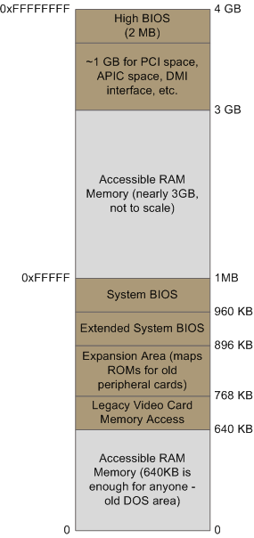

# [翻译] 主板芯片组和内存映射（1/3）

原文地址: https://manybutfinite.com/post/motherboard-chipsets-memory-map/

*译者前言：这是我翻译和收集的系统方向的第一篇文章，供交流和学习使用。*

*翻译时间：2020年2月10日*

此帖介绍现代（译者注：原文是2008年写的）Intel系列的主板架构、CPU如何访问内存以及系统的内存映射方法。

首先，我们来看一下Intel系列的计算机是如何将不同组件连接在一起的。下方的框图展现了在主板上所连接的一些主要部件。

图：现代主板连接示意图。北桥和南桥芯片构成了主板芯片组。

当你读到这里的时候，需要记住的一个关键点是CPU其实并不知道它到底连接到了什么设备。它通过引脚（[pins](https://en.wikipedia.org/wiki/Image:Intel_80486DX2_bottom.jpg)）与外界（设备）相连并进行交互，但并不关心所连接到的外界（设备）到底是什么。这可能是一台计算机的主板，但也可能是一个烤面包机、路由器、植入大脑的什么设备、或者是一个CPU test bench。总体而言，CPU主要通过三种方法和外部设备进行通信：1) 内存地址空间（内存映射的I/O）；2) I/O地址空间（端口映射I/O）；和3)中断。目前，我们先关注主板和内存这两个设备。

在主板上，CPU通向外界的通道是将CPU连接到北桥芯片的“前端总线”（front-side bus）。每当CPU需要对内存进行读或写的时候，都要通过这条前端总线。CPU通过某些引脚来传送需要读写的内存地址（地址线），而通过另外的一些引脚来发送或接收需要写和读的数据（数据线）。一个Intel Core 2 QX6600 CPU（很老的CPU了）有33个引脚（33位地址？）来传送物理内存地址（因此可以表示 2^33 个地址）。同时，它有64个引脚（64位数据线）来进行数据的收发（so data is transmitted in a 64-bit data path, or 8-byte chunks）。这种设计允许CPU物理寻址64GB的主存（2^33个地址 * 8-byte每个地址），尽管大多数的芯片组只能支持最多8GB的RAM。

我们经常将内存仅仅理解为是程序经常读写的RAM。事实上，绝大多数的内存读写请求的确是由北桥芯片转送给RAM模块的。但并非所有的内存读写都是对RAM的读写。对某物理地址的读写也可以用来实现与主板上各种外部设备的通信（这种通信方是称为内存映射的I/O方式，[Memory Mapped I/O](https://en.wikipedia.org/wiki/Memory-mapped_IO)）。这类设备的典型例子包括：显卡、大多数的PCI卡（如，扫描仪或SCSI卡），以及用于[**存储BIOS的闪存**](https://en.wikipedia.org/wiki/Flash_memory)。

当北桥芯片接收到一个来自CPU的物理内存请求时，它要决定将该请求路由给哪个设备：给RAM？或者是给显卡？北桥芯片依据**内存地址映射**来决定访存请求如何路由。对于物理地址空间中的每一段，内存地址映射都知道这一段是对应哪个设备。大部分的物理地址都是映射到RAM的，但是当它们指向的是其它设备时，内存地址映射会告诉芯片组应当由哪个设备来响应对相应物理地址的读写请求。这种将物理地址映射到RAM以外设备的方法，导致了PC主存位于640KB到1MB地址区间的经典的“内存空洞”问题。如果将内存地址保留给显卡和PCI设备使用，会进一步增大这个空洞。这就是为什么[32位的操作系统在使用4GB RAM时会遇到困难](https://support.microsoft.com/zh-cn/help/929605/the-system-memory-that-is-reported-in-the-system-information-dialog-bo)。在Linux中，`/proc/iomen`文件清晰地列出了内存地址的映射方式。下图展现了在一个Intel PC中典型的前4GB物理地址的映射方式。

图：Intel系统中前4GB**物理地址**的布局。

当然实际的布局取决于系统所采用的具体主板和所安装的设备，但大多数的酷睿2系统都非常接近以上布局。所有的棕色区域都映射到了RAM以外的设备。注意这些地址都是主板总线上所使用的**物理地址**。在CPU内部，我们的程序在访存的时候给出的是**逻辑地址**，并且需要经过CPU（MMU）转换为物理地址，才能通过总线去访问RAM或其它设备。

将逻辑地址转换成物理地址的过程相对复杂，具体转换的规则也取决于CPU所处的模式mode（实地址模式、32位保护模式、64位保护模式等）。先不深究各个模式所对应的地址转换规则，CPU所处的模式决定了其能寻址的物理内存的大小。例如，

* 当CPU是运行在32位模式时，其所能寻址的物理地址空间为4GB（有一种称为[物理地址扩展](https://en.wikipedia.org/wiki/Physical_address_extension)的技术，此处我们先略去）。因为最开始的1GB左右的物理地址被映射到了主板上的其它设备，此时CPU可以有效使用约3GB或者更少的RAM。
* 当CPU处于实模式时，它只能寻址1MB的RAM（这也是早期Intel处理器的能力上限了）。
* 当CPU处于64位模式时，它能够寻址64GB的物理地址空间（尽管很少有芯片组能够支持那么大的RAM）。在64位模式中，可以通过访问高于系统实际拥有RAM的物理地址空间来访问低地址处由于被映射到主板上其它设备而损失的物理地址空间。这种依靠芯片组的配合来完成的技术叫做reclaiming memory。

以上就是为下一个post所准备的有关内存的知识了。下一个post会详细讲解机器启动的过程（boot process）：从开机通电（power up）直至boot loader做好跳转到kernel的准备。如果你对这些内容感兴趣的话，我强烈推荐Intel所发布的手册。一些参考资料：

- [Datasheet for Intel G35 Chipset](http://download.intel.com/design/chipsets/datashts/31760701.pdf) documents a representative chipset for Core 2 processors. This is the main source for this post.
- [Datasheet for Intel Core 2 Quad-Core Q6000 Sequence](http://download.intel.com/design/processor/datashts/31559205.pdf) is a processor datasheet. It documents each pin in the processor (there aren't that many actually, and after you group them there's really not a lot to it). Fascinating stuff, though some bits are arcane.
- The [Intel Software Developer's Manuals](http://www.intel.com/products/processor/manuals/index.htm) are outstanding. Far from arcane, they explain beautifully all sorts of things about the architecture. Volumes 1 and 3A have the good stuff (don't be put off by the name, the "volumes" are small and you can read selectively).
- [Pádraig Brady](http://www.pixelbeat.org/) suggested that I link to Ulrich Drepper's excellent [paper on memory](http://people.redhat.com/drepper/cpumemory.pdf). It's great stuff. I was waiting to link to it in a post about memory, but the more the merrier.

*译者注：翻译这篇的目的也是为下一个post的boot process做准备。*

