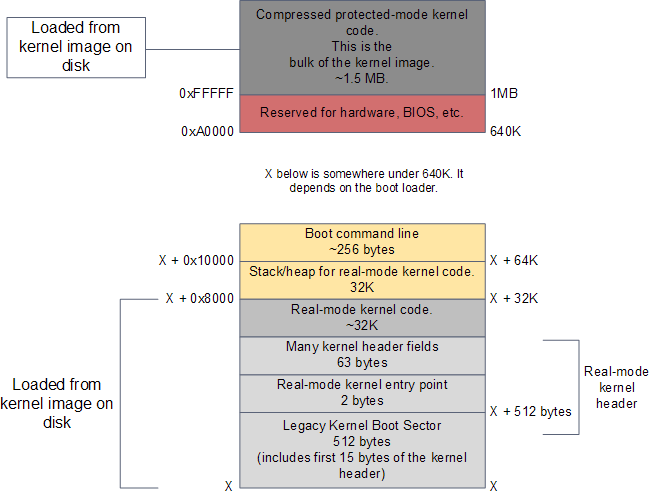
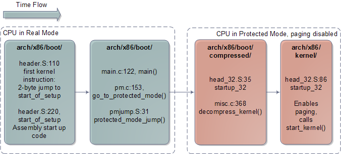

#  [翻译] 内核的启动过程（3/3）

原文地址: https://manybutfinite.com/post/kernel-boot-process/

*译者前言：哦哦，学习了*

*翻译时间：2020年2月14日*

在上一个帖子里，原作者介绍了计算机是如何开机启动并把kernel的镜像塞到了内存里，并且做好准备要跳转到kernel的入口地址开始执行。在原作者的这最后一个有关启动的贴子中，作者会带我们观察kernel的内部来了解一个操作系统是如何开始其运行的。由于作者对Linux有丰富的经验，本贴中的内容会大量链接到在[Linux Cross Reference](http://lxr.linux.no/)上的Linux kernel 2.6.25.6。如果你对C语言的语法比较熟悉，那这些代码的可读性是很好的；即使有些细节没能把握住，你也能很好地掌握代码的核心功能。**真正的挑战来自于缺乏对代码所处的上下文的深入理解，比如，什么时候或为什么这段代码能执行，或者在其背后机器的特性**。因此，本文作者试图提供一点关键的上下文信息。由于这是一个简短（hah!）的教程，很多很有意思的东西 - 比如中断和存储 - 只能点到即止。本贴写到对Windows boot的要点为止。

（接上一帖的过程，）到这个时间点，在Intel x86的启动过程中，CPU此时正处于实模式，它能够访问1MB的内存，对于一个现代的Linux操作系统来说，RAM看起来如下图所示：

图：RAM contents after boot loader is done

内核镜像是由boot loader通过调用BIOS的磁盘I/O服务程序来从磁盘装载到内存中的。这个装载的内容是和你在磁盘上的某个内核文件一模一样的（*这个和PA的kernel装载方式一样嘛*），例如，**/boot/vmlinuz-2.6.22-14-server**。

> QEMU的-kernel参数是bzImage，gdb调试器才是用的vmlinux。

这个镜像文件被分成两个部分：1）一个比较小的，包含了实模式内核代码（real-mode kernel code）的部分，被装载到内存640KB（地址0xA0000）以下部分；2）内核剩余的那一大部分，包含执行在保护模式的代码，被装载到内存1MB（地址0x100000）以上的位置。

Kernel的启动过程从上图（下半部分，640KB以下）所示的实模式对应的kernel头（real-mode kernel header）开始。这一部分内存用来实现boot loader和kernel之间的Linux启动协议（[the Linux boot protocol](http://lxr.linux.no/#linux+v2.6.25.6/Documentation/i386/boot.txt)）。这其中的部分数据由boot loader在运行时*读取*。其中包括了某些辅助信息如人类可读的包含内核版本的字符串，也包括许多关键信息如实模式内核的大小等。同时，boot loader也会将一些数据*写入*这个内存区域，比如用户在启动菜单上所给出的需要传给内核的启动参数的存储地址等。一旦boot loader运行结束，它能够保证将kernel header所需要的所有参数都填上了。此时就应当跳转到内核的入口（kernel entry point）开始继续执行了。下图给出了Linux内核在初始化过程中代码的执行顺序，同时也标出了相应源码所在的文件夹、源文件和行号（*新版内核可能会有所更改*）。

图：Architecture-specific Linux Kernel Initialization

Kernel对应Intel架构的最开始的启动代码位于[arch/x86/boot/header.S](arch/x86/boot/header.S)文件中。这段代码用汇编语言书写，是一种对于操作系统内核而言相对罕见但在启动代码中常见的写法。

> header.S文件，_start符号处对应的0xeb的确是bzImage文件反汇编后开头第一条指令所对应的内容。通过修改此处内容可以发现bzImage开头的内容随之改变。但是不能随便改header.S，否则编译出来的kernel QEMU不认，会报qemu: linux kernel too old to load a ram disk错误。
>
> 这里我有点不明白，QEMU管我linux kernel的事情干啥？/hw/i386/pc.c打印的。在load_linux函数中，根据protocol来判断的。由此可见，执行到这一步时，已经知道自己是在load Linux了。根据上一篇文章的内容，那就是GRUB设置好的参数。但在QEMU中实现load Linux，也比较神奇。

> 强制要求QEMU在bzImage的开头指令处停止，获取信息：
>
> Booting from ROM..  # boot loader或者机器打印的
>
> print debug information at EIP = 00010201 (由于插桩的实现原因，此处应当-1) # 我的插桩代码打印的
> Content:  eb 66 48 64 72 53 0d 02 # 我的插桩代码打印的
>
> 实际的breakpoint应该设置在0x10200，0x10000（64KB） + 512B
>
> hbreak *0x10200，对应指令`jmp 0x10268`

> (gdb) hbreak *0x10200
> Hardware assisted breakpoint 1 at 0x10200
> (gdb) c
> Continuing.
>
> Program received signal SIGTRAP, Trace/breakpoint trap.
> 0x00000000 in ?? ()
> (gdb) info r
> eax            0x1020              4128
> ecx            0x0                 0
> edx            0x0                 0
> ebx            0x0                 0
> esp            0xfff0              0xfff0
> ebp            0x0                 0x0
> esi            0x0                 0
> edi            0x0                 0
> eip            0x0                 0x0
> eflags         0x46                [ IOPL=0 ZF PF ]
> cs             0x1020              4128    #地址转换方式：cs << 4 + eip => 0x10200
> ss             0x1000              4096
> ds             0x1000              4096
> es             0x1000              4096
> fs             0x1000              4096
> gs             0x1000              4096
> fs_base        0x10000             65536
> gs_base        0x10000             65536
> k_gs_base      0x0                 0
> cr0            0x10                [ ET ]   #实模式
> cr2            0x0                 0
> cr3            0x0                 [ PDBR=0 PCID=0 ]
> cr4            0x0                 [ ]
> cr8            0x0                 0
> efer           0x0                 [ ]

header.S这个文件的头部其实包含的boot sector里面的代码，是早年间Linux可以不依赖boot loader就可以启动时的遗产代码。现今如果这段代码被执行的话，只会输出一段"bugger_off_msg"，并且自动重启（可以通过读header.S的代码理解）。如今的boot loader会忽略这一段遗产代码。在这一段遗产boot sector之后，我们有real-mode kernel header的最早的15字节；这两段加起来一共是512字节（0x200），是一个典型的Intel硬件上一个磁盘扇区的大小。

在这个512字节之后，在偏移量为0x200处，我们可以找到Linux kernel的第一条指令（如上所述，地址0x10200，对应指令`jmp 0x10268`）。它位于[header.S:100](http://lxr.linux.no/linux+v2.6.25.6/arch/x86/boot/header.S#L110)，是一个2字节的直接以机器码进行硬编码jump指令0x3aeb（这一段以上面译者基于linux-5.2.1的分析为准）。你可以通过hexdump命令查看kernel镜像在0x200处的内容来验证这一点 - 只是为了确认这一切不是一场梦。

> objdump -d bzImage | less

> bzImage:     file format pei-i386
>
>
> Disassembly of section .setup:
>
> 00000200 <.setup>:
>      200:       eb 66                   jmp    0x268

> hexdump -C bzImage | less

> 000001f0  ff 1f 01 00 b4 37 07 00  00 00 ff ff 00 00 55 aa
> 00000200  **eb 66** 48 64 72 53 0d 02  00 00 00 00 00 10 40 32
> 00000210  00 01 00 80 00 00 10 00  00 00 00 00 00 00 00 00

Boot loader接着跳转到该地址（跳转到[header.S:229](http://lxr.linux.no/linux+v2.6.25.6/arch/x86/boot/header.S#L229)），在那里有一段汇编语言写的过程，称为`start_of_setup`。这一小段代码会为实模式下的内核（real-mode kernel）设置好栈，并且将bss段清零（这一段里面包含static变量，清零是将其初始值置为0），然后跳转到位于[arch/x86/boot/main.c:122](http://lxr.linux.no/linux+v2.6.25.6/arch/x86/boot/main.c#L122)的C代码继续执行。

> header.S的实际执行流程：

> 0x10200:     jmp    0x10268						# start_of_setup-1f
> 0x10268:     mov    %ds,%eax					# 0x1000
> 0x1026a:     mov    %eax,%es
> 0x1026c:     cld
> 0x1026d:     mov    %ss,%edx					# 0x1000
> 0x1026f:     cmp    %eax,%edx
> 0x10271:     mov    %esp,%edx					# 0xfff0
> 0x10273:     je     0x1028b
> 0x1028b:     and    \$0xfffffffc,%edx			# 0xfff0
> 0x1028e:     jne    0x10293
> 0x10293:     mov    %eax,%ss					#  0x1000
> 0x10295:     movzww %dx,%sp				# 0xfff0，**设置栈**
> 0x10299:     sti
> 0x1029a:     push   %ds
> 0x1029b:     push   \$0x66cb029f				# pushw	\$6f，准备**重新设置cs**
> 0x1029e:     lret			                			# 之后 cs = 0x1000，实模式，之前 cs = 0x1020, 
> 0x1029f:     cmpw   \$0x3f38,(%esi)		# cmpl \$0x5a5aaa55, setup_sig，这里反汇编有点问题
> 0x102a8:     jne    0x102c1						# jne setup_bad
> 0x102aa:     mov    \$0x73b93f40,%edi	# movw \$_ _ bss_start, %di，清零bss节 
> 0x102ad:     mov   \$0x31665273,%ecx		# movw \$_end+3, %cx 这两条指令源文件中都是16位的
> 0x102b0:     xor    %ax,%ax						# xorl	%eax, %eax 怀疑是gdb的反汇编有问题？
> 0x102b3:     sub    %edi,%ecx					# subw	%di, %cx
> 0x102b5:     shr    \$0x2,%ecx					# shrw	\$2, %cx
> 0x102b8:     rep stos %ax,%es:(%edi)		# 循环**清零bss节**
> 					\# Jump to C code (should not return)
> 0x102bb:     callw  0x2e2a		      # calll main, 

main()函数会做一些维护工作，比如检测内存的布局，设置显示模式等。它接着调用[go_to_protected_mode()](http://lxr.linux.no/#linux+v2.6.25.6/arch/x86/boot/pm.c#L153)函数。但是在CPU可以被设置为保护模式运行前，还有一些事情必须完成。其中有两件比较关键的事情：中断和内存。在实模式下，[中断向量表](https://en.wikipedia.org/wiki/Interrupt_vector_table)存储在内存地址为0处。但在保护模式下，相应的中断描述符表的首地址是存储在CPU的IDTR寄存器中的。同时，针对内存，从逻辑地址（程序所访问地址）向线性地址的转换在实模式和保护模式下也有所不同。在保护模式下，需要访问首地址存储在GDTR寄存器中的[全局描述符表](https://en.wikipedia.org/wiki/Global_descriptor_table)来完成从逻辑地址到线性地址的转换。因此，go_to_protected_mode() 函数会调用[setup_ide()](http://lxr.linux.no/#linux+v2.6.25.6/arch/x86/boot/pm.c#L144)和[setup_gdt()](http://lxr.linux.no/#linux+v2.6.25.6/arch/x86/boot/pm.c#L115)两个函数来设置一个临时的中断描述符表（IDT）和全局描述符表（GDT）。

至此，我们已经准备好要进入保护模式了，这是由另一个汇编书写的过程，[protected_mode_jump](http://lxr.linux.no/#linux+v2.6.25.6/arch/x86/boot/pmjump.S#L31)来完成的。这个过程通过将CPU的CR0寄存器的PE位设置为1来开启保护模式。到目前，我们仍运行在[分页机制](https://en.wikipedia.org/wiki/Paging)**关闭**的状态；分页是CPU的一项可选特性，即使是在保护模式下，目前我们尚不需要开启。在开启了保护模式后，重要的是我们已经不在局限于640KB的内存，而是可以寻址最大4GB的RAM了，在当前这个阶段是够用了。这个汇编的过程最后调用32位kernel的入口，这是位于压缩后kernel的[startup_32](http://lxr.linux.no/#linux+v2.6.25.6/arch/x86/boot/compressed/head_32.S#L35)这个地址。这个过程在完成了一些基本的寄存器初始化后，调用[decompress_kernel()](http://lxr.linux.no/#linux+v2.6.25.6/arch/x86/boot/compressed/misc.c#L368)，一个用于解压kernel的C函数。

